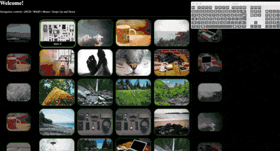

# carouschnell

Responsive and Configurable Typescript based React component to make carousels schnell (=quickly in German)

<div align="center"></div>

## Motivation

I was in need of a component that could serve kind of like a navigable homescreen for a personal project, figured to generalise some bits here and there and release it to the wild.

# Installation

```bash
TODO
```

# Usage

The carouschnell package exports a Carousel React component together with default styles which the developer can use. An example of an instantiation of this component can be found below.

```javascript
// App.js
import React from "react";
import "./App.css";
const carouschnell = require("carouschnell");

function App() {
    const config = {
        rows: [
            {
                initialColumn: 3,
                label: "Row1",
                items: [
                    { caption: "1", thumbnail: "http://placekitten.com/g/200/150", url: "" },
                    { caption: "2", thumbnail: "http://placekitten.com/g/200/150", url: "" },
                    { caption: "3", thumbnail: "http://placekitten.com/g/200/150", url: "" },
                    { caption: "4", thumbnail: "http://placekitten.com/g/200/150", url: "" },
                    { caption: "5", thumbnail: "http://placekitten.com/g/200/150", url: "" },
                ],
            },
            {
                initialColumn: 3,
                label: "Row2",
                items: [
                    { caption: "6", thumbnail: "http://placekitten.com/g/200/150", url: "" },
                    { caption: "7", thumbnail: "http://placekitten.com/g/200/150", url: "" },
                    { caption: "8", thumbnail: "http://placekitten.com/g/200/150", url: "" },
                    { caption: "9", thumbnail: "http://placekitten.com/g/200/150", url: "" },
                    { caption: "10", thumbnail: "http://placekitten.com/g/200/150", url: "" },
                ],
            },
        ],
        displayConfig: {
            rowStart: 0,
            rowEnd: 1,
            rowOverrun: 0,
            columnStart: 0,
            columnEnd: 2,
            columnOverrun: 1,
            initialDisplayRow: 0,
            initialDisplayColumn: 0,
        },
        navControls: {
            enable2dNav: true,
            keyboard: {
                enabled: true,
                keyMapping: carouschnell.DEVICE_NAV_KEYCODES_DEFAULT,
            },
            pointer: {
                enabled: true,
                eventBindElementId: "carousel",
            },
            touch: {
                enabled: true,
                eventBindElementId: "root",
            },
        },
        styleConfig: carouschnell.defaultStyles.darkStyle,
    };

    return (
        <div className="App">
            <h1>Welcome!</h1>
            <p>Navigation controls: LRUD | WASD | Mouse | Swipe Up and Down</p>
            <div className="content" id="carousel">
                <carouschnell.Carousel config={config} />
            </div>
        </div>
    );
}
export default App;
```

## CarouselConfig

The Carousel component can be instantiated by passing a config object that conforms to the CarouselConfig type. The CarouselConfig defines:

1. The items that must be displayed
2. The way to to display the items (how many rows/columns)
3. The amount of item overrun in rows/columns
4. Navigation control configuration (e.g. keyboard keys to respond to, pointer support etc)
5. The style of the Carousel (colors, sizes etc)
6. Abstract item actions all the way up to the config, enabling the user to specify what should happen when an item is hit. Could consider an optional callback. At the moment only a redirect is supported.

Carouschnell offers a versatile and customisable Carousel component. In order to create an instance of the Carousel component that satisfies your needs it is important to fully understand the CarouselConfig. Below you can find some details of the individual properties of the CarouselConfig. The CarouselConfig is a POJO configuring, JS users of this lib have to be aware to ensure no mandatory properties are missing. TS users can use the CarouselConfig type definition to ensure a valid instance of the config is passed to the Carousel component when rendering.

### Active/Overrun

Each item that is displayed in each row and column of the carousel can be within the _active_ or _overrun_ view. The active view shows the items that are displayed to the user and wherein navigation is possbiel. The overrun view shows the items that fall outside the definition of the active view but are yet made visible in a specific way to the user, for example to indicate more items in certain navigational directions of the carousel. To configure this behaviour the developer must populate the _displayConfig_ field of the CarouselConfig. The type definition for the displayConfig can be found below, together with example values in comment.

```typescript
type CarouselDisplayConfig = {
    rowStart: number; // 1
    rowEnd: number; // 2
    rowOverrun: number; // 1
    columnStart: number; // 0
    columnEnd: number; // 3
    columnOverrun: number; // 1
    initialDisplayRow: number; // 1
    initialDisplayColumn: number; // 0
};
```

Using the example values as provided in comment in the code block above would render a carousel grid as shown in the picture below. The active view uses a green background color, the overrun uses a blue background color. Note that a sufficient amount of carousel items must be provided through the config. It would not make sense to define row or column ranges that do not match the provided amount of items.

<div align="center"></div>

### 2D Nav

Carouschnell provides an option to enable 2D navigation. This means overrun exists in 2 dimensions, both in columns and rows. The picture above shows this concept, so does the example project that is part of this repo. 2D nav can be easily turned on or off through the CarouselConfig, see _navControls.enable2dNav_. When 2D navigation is turned off overrun is only supported in the column direction (left to right). This means that it does not make sense to define a _DisplayConfig_ referring to rows outside of the active area when having 2D navigation disabled. The gif below demonstrates 2D navigation.

<div align="center"></div>

## Style
The style for every aspect of the carousels can be configured through the CarouselConfig. Please consult the See the type definitions related to the style attribute of the See [CarouselConfig](src/config/CarouselConfig.ts) of this repo.

### Responsive
Carouschell responsiveness is based on three breakpoints: small (767), desktop (1024) and large (1366). Using the JS-CSS config definitions of the CarouselConfig you can define the item and border sizes that are applicable for a particular breakpoint.

<div align="center"></div>

For example, you can define the item sizes that should be applied on each of the three breakpoints individually. Below you can find a code snippet that does this. For examples of full configurations of the CarouselStyleConfig please have a look at the [default styles](src/styles/defaultStyles.ts) that are provided by this package.

```typescript
const defaultItemSizeSmall: CarouselStyleConfigItemSize = {
    size: {
        x: 100,
        y: 75,
    },
    margin: {
        x: 10,
        y: 10,
    },
};

const defaultItemSizeDesktop: CarouselStyleConfigItemSize = {
    size: {
        x: 200,
        y: 150,
    },
    margin: {
        x: 20,
        y: 20,
    },
};
```

# Examples

An example of an instantiation of carouschnell can be found in the example directory of this repo. You can run the example by cloning this repo and calling:

```bash
npm install
npm run start:example
```

This will use react-app-rewired to wire the example with the carouschnell source code that is checked out locally on your machine. As such, changes you make locally will be automatically reflected in the example.

# TODOs

1. Add more default styles that are ready to be used.
2. Optionally visualize the label as assigned for a row in the component config on top of the row.
3. Fix bug where active border is shifted when the rowStart and rowOverrun violate eachother.
4. Publish @types package to support strong-typed instantiation of Carousels in TS.
5. Lazy loading for thumbnails (define offset parameters when to load also in config)

# Contributing

All contributions to this project are welcome and I hope you'd like to get involved. Any contributions you make are greatly appreciated.

1. Clone this Project
2. Create a Feature Branch (git checkout -b my-new-feature)
3. Commit your Changes (git commit -m 'My contribution')
    1. Prettier will format the code files
    2. Husky will force all tests to pass before the commit is accepted
4. Push to the Branch (git push)
5. Open a Pull Request
