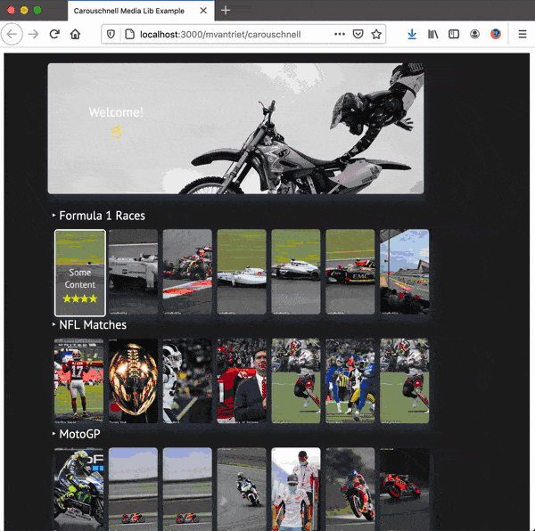
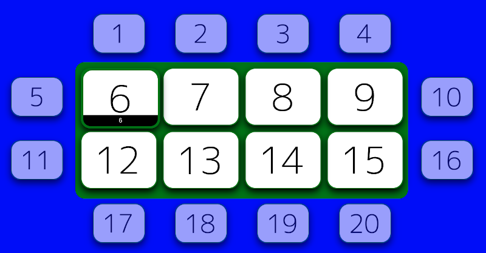
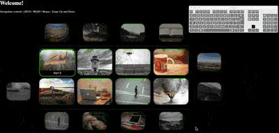
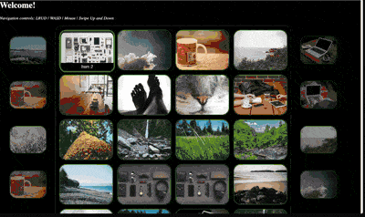
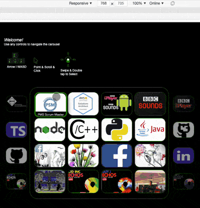

# carouschnell

Responsive and Configurable Typescript based React component to make carousels schnell (=quickly in German)

<div align="center"></div>

## Motivation

I was in need of a component that could serve kind of like a navigable homescreen for a personal project, figured to generalise some bits here and there and release it to the wild.

# Installation

```bash
npm install carouschnell
```

# Usage

The carouschnell package exports a Carousel React component together with default styles which the developer can use. An example of an instantiation of this component can be found below.

```javascript
// App.js
import React from "react";
import "./App.css";
const carouschnell = require("carouschnell");

function App() {
    const config = {
        rows: [
            {
                initialColumn: 3,
                label: "Row1",
                items: [
                    { caption: "1", thumbnail: "http://placekitten.com/g/200/150", url: "" },
                    { caption: "2", thumbnail: "http://placekitten.com/g/200/150", url: "" },
                    { caption: "3", thumbnail: "http://placekitten.com/g/200/150", url: "" },
                    { caption: "4", thumbnail: "http://placekitten.com/g/200/150", url: "" },
                    { caption: "5", thumbnail: "http://placekitten.com/g/200/150", url: "" },
                ],
            },
            {
                initialColumn: 3,
                label: "Row2",
                items: [
                    { caption: "6", thumbnail: "http://placekitten.com/g/200/150", url: "" },
                    { caption: "7", thumbnail: "http://placekitten.com/g/200/150", url: "" },
                    { caption: "8", thumbnail: "http://placekitten.com/g/200/150", url: "" },
                    { caption: "9", thumbnail: "http://placekitten.com/g/200/150", url: "" },
                    { caption: "10", thumbnail: "http://placekitten.com/g/200/150", url: "" },
                ],
            },
        ],
        displayConfig: {
            rowStart: 0,
            rowEnd: 1,
            rowOverrun: 0,
            columnStart: 0,
            columnEnd: 2,
            columnOverrun: 1,
            initialDisplayRow: 0,
            initialDisplayColumn: 0 /*,
            enableLazyLoading: true, // <-- enable lazy loading
            lazyLoadingRelativeOffset: 2 */,
        },
        navControls: {
            enable2dNav: true,
            autoScroll: true,
            keyboard: {
                enabled: true,
                keyMapping: carouschnell.DEVICE_NAV_KEYCODES_DEFAULT,
            },
            pointer: {
                enabled: true,
                eventBindElementId: "carousel",
                scrollLock: true,
            },
            touch: {
                enabled: true,
                eventBindElementId: "carousel",
                scrollLock: true,
            } /*,
            customNavControllers: [{
                enabled: true,
                acceptorCb: (carousel) => {
                    carousel.handleNavControlDirectionAction(carouschnell.NAV_DIRECTION.LEFT, 1)
                }
            }]
            */,
        },
        styleConfig: carouschnell.defaultStyles.darkStyle,
    };

    return (
        <div className="App">
            <h1>Welcome!</h1>
            <p>Navigation controls: LRUD | WASD | Mouse | Swipe Up, Down, Left and Right</p>
            <div className="content" id="carousel">
                <carouschnell.Carousel config={config} />
            </div>
        </div>
    );
}
export default App;
```

## CarouselConfig

The Carousel component can be instantiated by passing a config object that conforms to the [CarouselConfig type](src/config/CarouselConfig.ts). The CarouselConfig defines:

1. The items that must be displayed
2. The way to to display the items (how many rows/columns)
3. The amount of item overrun in rows/columns
4. Navigation control configuration (e.g. keyboard keys to respond to, pointer support etc)
5. The style of the Carousel (colors, sizes etc)
6. Abstract item actions all the way up to the config, enabling the user to specify what should happen when an item is hit. Could consider an optional callback. At the moment only a redirect is supported.

Carouschnell offers a versatile and customisable Carousel component. In order to create an instance of the Carousel component that satisfies your needs it is important to fully understand the CarouselConfig. Below you can find some details of the individual properties of the CarouselConfig. The CarouselConfig is a POJO configuring, JS users of this lib have to be aware to ensure no mandatory properties are missing. TS users can use the [CarouselConfig type](src/config/CarouselConfig.ts) definition to ensure a valid instance of the config is passed to the Carousel component when rendering.

### Active/Overrun

Each item that is displayed in each row and column of the carousel can be within the _active_ or _overrun_ view. The active view shows the items that are displayed to the user and wherein navigation is possbiel. The overrun view shows the items that fall outside the definition of the active view but are yet made visible in a specific way to the user, for example to indicate more items in certain navigational directions of the carousel. To configure this behaviour the developer must populate the _displayConfig_ field of the CarouselConfig. The type definition for the displayConfig can be found below, together with example values in comment.

```typescript
type CarouselDisplayConfig = {
    rowStart: number; // 1
    rowEnd: number; // 2
    rowOverrun: number; // 1
    columnStart: number; // 0
    columnEnd: number; // 3
    columnOverrun: number; // 1
    initialDisplayRow: number; // 1
    initialDisplayColumn: number; // 0
    enableLazyLoading?: boolean; // false if not defined
    lazyLoadingRelativeOffset?: number; // 0 if not defined
};
```

Using the example values as provided in comment in the code block above would render a carousel grid as shown in the picture below. The active view uses a green background color, the overrun uses a blue background color. Note that a sufficient amount of carousel items must be provided through the config. It would not make sense to define row or column ranges that do not match the provided amount of items.

<div align="center"></div>

### 2D Nav

Carouschnell provides an option to enable 2D navigation. This means overrun exists in 2 dimensions, both in columns and rows. The picture above shows this concept, so does the example project that is part of this repo. 2D nav can be easily turned on or off through the CarouselConfig, see _navControls.enable2dNav_. When 2D navigation is turned off overrun is only supported in the column direction (left to right). This means that it does not make sense to define a _DisplayConfig_ referring to rows outside of the active area when having 2D navigation disabled. The gif below demonstrates 2D navigation.

<div align="center"></div>

### Lazy Loading

Lazy loading of images on the invidividual carousel items can be configured through the [DisplayConfig](src/config/CarouselConfig.ts). Lazy loading is enabled when setting _enableLazyLoading_ to true. Carouschnell will load all the item images at initialisation that are in the active and overrun area of the grid. Additionally, Carouschnell can be configured to load item images when the user is 'close' in terms of navigation. This can be defined through the _lazyLoadingRelativeOffset_ property in the [DisplayConfig](src/config/CarouselConfig.ts). If _lazyLoadingRelativeOffset_ is specified and _>0_ it will be used to load item images for the items that fall within a 2D boundary offset from the currently selected position in the grid.

An demo showing the Lazy Loading behaviour can be found in the [Lazy Loading Example](examples/demoLazyLoading) directory of this repo.

## Style

The style for every aspect of the carousels can be configured through the CarouselConfig. Please consult the See the type definitions related to the style attribute of the See [CarouselConfig](src/config/CarouselConfig.ts) of this repo.

Carouschnell is shipped with default styles. The default styles can be found in the [styles](src/styles) directory of this repo, and can be used in an application directly by assigning the _styleConfig_ property of the [CarouselConfig](src/config/CarouselConfig.ts) to any default style provided by Carouschnell.

| Style       | Example                             | Import                                  |
| ----------- | ----------------------------------- | --------------------------------------- |
| Dark Style  | [demo2d](examples/demo2d)           | _carouschnell.defaultStyles.darkStyle_  |
| Light Style | [basicSlider](examples/basicSlider) | _carouschnell.defaultStyles.lightStyle_ |

Naturally the user of this lib can use the default styles as a starting point; assign bits to new variables when constructing a [CarouselConfig](src/config/CarouselConfig.ts) and override the bits that require changes.

### Responsive

Carouschell responsiveness is based on three breakpoints: small (767), desktop (1024) and large (1366). Using the JS-CSS config definitions of the CarouselConfig you can define the item and border sizes that are applicable for a particular breakpoint.

<div align="center"></div>

For example, you can define the item sizes that should be applied on each of the three breakpoints individually. Below you can find a code snippet that does this. For examples of full configurations of the CarouselStyleConfig please have a look at the [default styles](src/styles/defaultStyles.ts) that are provided by this package.

```typescript
const defaultItemSizeSmall: CarouselStyleConfigItemSize = {
    size: {
        x: 100,
        y: 75,
    },
    margin: {
        x: 10,
        y: 10,
    },
};

const defaultItemSizeDesktop: CarouselStyleConfigItemSize = {
    size: {
        x: 200,
        y: 150,
    },
    margin: {
        x: 20,
        y: 20,
    },
};
```

### Row Labels
Optionally Carouschnell will add labels for each row in your Carousel according to the rows as part of the [CarouselConfig](src/config/CarouselConfig.ts). The *rowLabelStyleConfig* property of the [CarouselConfig](src/config/CarouselConfig.ts) can be used for this purpose. Check out the [Media Library example](examples/mediaLib/src/App.tsx) in the examples folder how to use row label styling.

### Item Selection custom HTML
Instead of submitting mere a caption for each item in the [CarouselConfig](src/config/CarouselConfig.ts) you can optionally override the default styling and submit custom HTML to customise the look and feel when an item is selected. See the *innerHtml* property within the [CarouselConfig](src/config/CarouselConfig.ts) and check out the [Media Library example](examples/mediaLib/src/App.tsx) in the examples folder how to use custom styling that is displayed when an item is selected by the user.

## Nav Controls

Carouschnell currently three controllers to support navigation: keyboard, pointer and swiping. Each can be individually configured through the CarouselConfig. An example of _navControl_ definitions can be found in the [example](examples/demo2d/src/App.tsx) provided by this repo. Carouschnell includes a configurable implementation for each controller.

The keyboard navigation controller registers to _keydown_ and _keyup_ events and associates keypresses with a navigation action, i.e.: LEFT, RIGHT, UP, DOWN, ENTER. In order to realise this a keymapping must be provided through the CarouselConfig. A default keymapping is provided by the navigation controller for ease of use. This default keymapping maps the **L**eft **R**ight **U**p, **D**own, **W A S D** and the **E**nter keys to the associated navigation actions in Carouschnell. See the [example](examples/demo2d/src/App.tsx) in this repo which demonstrates how to use the default keymapping. Naturally, a custom keymapping can be provided. Long keypresses are handled by injecting a navigation action every 300ms, enabling the user to press down on a supported key and navigating continously.

The pointer navigation controller registers for _wheel_ and _mousemove_ events of the configured elementId and associates the events with a navigation action. Scrolling up & down and right & left (if supported by the user's mouse) the corresponding navigation action will be triggered. The user can hover over the individual items in the active area of the carousel to select items directly.

The touch navigation controller registers for the _touchstart_, _touchmove_ and _touchend_ events of the configured elementId and associates swipes with a navigation action. For each swipe the dominant direction is computed and the associated navigation on the carousel gets fired. An example for the support of swipes is shown in the gif below.

<div align="center"></div>

## Scrolling Behaviour

Carouschnell is designed to provide a quick way to create Carousels for various devices, including devices for which scrolling is not always desirable. As such, Carouschnell can be configured to automatically scroll the selected Item in the Carousel into view. See the _autoScroll_ property of the CarouselConfig.

As mentioned above, Carouschnell supports various navigation controllers: keyboard, pointer and touch. Carouschnell adds the option to disable scrolling for configurable HTML elements in order to support smooth operation of the pointer and touch navigation controller. This prevents the situation when for example a mobile device triggers a scroll event whenever a swipe is carried out on the Carousel.

Note that configuring the _scrollLock_ option in the CarouselConfig for the pointer and touch navigation controller does not impact the scrolling behaviour of the entire page. As the navigation controller can be bound to a specific HTML element. For example, the developer could enable the touch navigation controller only for a _div_ within the page wherein the Carousel is used. This way the _scrollLock_ option can be set to true without breaking the scrolling options of the rest of the page.

## Examples

Examples of carouschnell can be found in the [examples](examples/) directory of this repo. The main example (demo2d) can be run by cloning this repo and calling:

```bash
npm install
npm run start:example
```

This will use react-app-rewired to wire the example with the carouschnell source code that is checked out locally on your machine. As such, changes you make locally will be automatically reflected in the example.

## TODOs

1. <del>Add more default styles that are ready to be used.</del>
2. Optionally visualize the label as assigned for a row in the component config on top of the row.
3. <del>Fix bug where active border is shifted when the rowStart and rowOverrun violate eachother.</del>
4. <del>Publish @types package to support strong-typed instantiation of Carousels in TS.</del>
5. <del>Lazy loading for thumbnails (define offset parameters when to load also in config).</del>
6. <del>Add support for mouse navigation by clicking in overrun area to enable navigation action in any direction (left, right, up or down).</del>

## Contributing

See [CONTRIBUTING](CONTRIBUTING.md).
